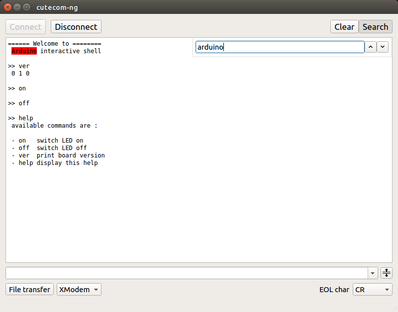

# 说明

本分支为个人修改版。添加一些个人常用的功能

## 截图


# Cutecom-ng #

Cutecom-ng is a graphical serial port terminal,<br>
&nbsp;&nbsp;available for all major platforms (Linux, Mac OSX and Windows),<br>
&nbsp;&nbsp;written in Qt5

## Screenshot


## Features

 - auto-detection of serial ports
 - readline-like history for sent commands
 - splittable terminal window for easy browsing
 - handy search feature
 - configurable end of line char
 - binary or text-mode dump file
 - XModem file transfer
 - more to come... contributions welcome :smiley:

## Installation

**Cutecom-ng** binaries are available for **Linux**, **Windows** and **Mac OSX**

### Download pre-built binaries

They are all available [here](https://github.com/develersrl/cutecom-ng/releases)

 - **deb package** for debian based **Linux** flavors
 - **dmg archive** for **Mac OSX**
 - **zip file** with binaries for **Windows**

#### Debian based distributions: Ubuntu, Mint, etc.

1. download the debian package file [here](https://github.com/develersrl/cutecom-ng/releases)

2. ```sudo dpkg -i cutecom-ng_0.5_amd64.deb``` <br>

3. if dpkg complains about some missing dependencies, run:

```sudo apt-get -f install```
or install them yourself

#### Mac OSX

Install **cutecom-ng.dmg**

#### Windows

Extract zip content where you want


#### Distributions without debian package management

Follow the steps in *Build the release yourself*

### Build the release yourself

If you want the latest cutecom-ng improvements, not yet available in a pre-built binary, or if your pre-built binaries are not available for your platform

1. download / install Qt5 and the QSerialPort add-on

2. clone cutecom-ng repository:  
```git clone https://github.com/develersrl/cutecom-ng```

3. open ./cutecom-ng/cutecom-ng.pro with QtCreator
4. build

## Usage / Tips

### Serial port emulation

you can easily emulate a serial port with **gnu-screen**

 1. download and install **gnu-screen**

 for linux distros with apt package management<br>```sudo apt-get install screen```  

 2. if your serial port is `/dev/ttyUSB0`, you do  
```screen /dev/ttyUSB0 115200```<br>to open the port at the specified baudsrate

### Null-modem cable emulation example

To emulate a null-modem connection, you can use **socat** and
**gnu-screen**.

In our example, we will transmit a file with **cutecom-ng** using the XModem
protocol, to a virtual serial port created with socat.<br>**screen** and **rx**
are handling the XModem reception

 1. install **socat**, **gnu-screen** and **lrzsz** packages:<br>
 ```sudo apt-get install socat screen lrzsz```<br>on ubuntu and other **apt**
 based linux distros

 2. open 2 terminals

 3. in the 1st terminal, run:<br>
```socat -d -d pty,raw,echo=1 pty,raw,echo=1```<br>
basically we tell `socat` to create 2 virtual ports and to open them,<br>this is
the kind of output that you should have:
```
2015/07/10 09:36:44 socat[18188] N PTY is /dev/pts/12
2015/07/10 09:36:44 socat[18188] N PTY is /dev/pts/16
2015/07/10 09:36:44 socat[18188] N starting data transfer loop with FDs [3,3] and [5,5]
```
In our example **socat** created and opened
`/dev/pts/12` and `/dev/pts/16`.
Arbitrarily, we will choose to use `/dev/pts/12` for transmission and `/dev/pts/16` for reception.
 4. in the 2nd terminal, run:<br>```screen /dev/pts/16 115200```<br>
this opens a **screen** session on `/dev/pts/16` with a baudsrate of 115200.<br>
Once inside **screen**, *[CTRL-A]* followed by `:` opens a prompt at the bottom
left of the **screen** window, write this command but don't run it:<br>
```exec !! rx filename```<br>
 5. open port ```/dev/pts/12``` in Cutecom-ng, with a baudsrate of 115200 and the
default connection settings
 6. Click on XModem and choose a file to send. After having clicked to start the
transmission, come back to the **gnu-screen** terminal and execute the command
 7. You can now enjoy the full speed of an XModem transmission :sunglasses:

If all goes well, a copy of `myfile` named `filename` should be created in the
directory you were when you opened the screen session.

:exclamation: Warning, if filename exists it will be overwritten

### more fun with socat :

#### use cutecom-ng as a shell terminal :
do
```
socat -d -d pty,raw,echo=1 SYSTEM:"/bin/bash"
```
and connect cutecom-ng to the PTY created by socat

## Contributions/Bugs

All contributions are welcome!  
Don't hesitate to file an issue in case of bug, including as many details as you 
can (version, platform, qt version, how to reproduce, ...)

## Credits

People and projects deserving credits are listed in [CREDITS](./CREDITS)

## License

Cutecom-ng is released under the GPL3, see [LICENSE](./LICENSE)
