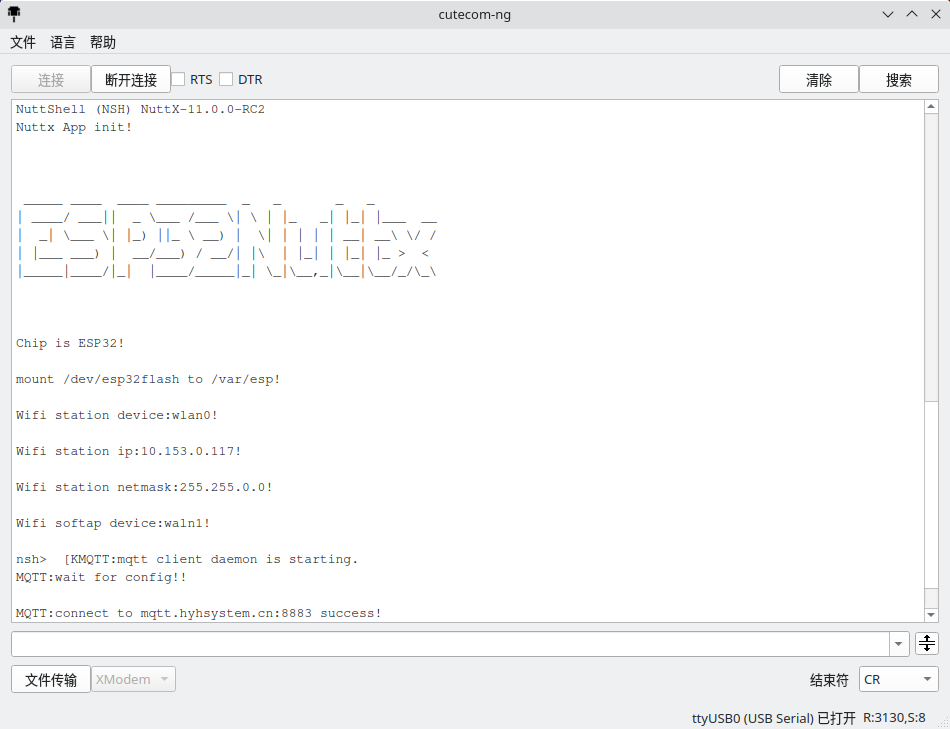
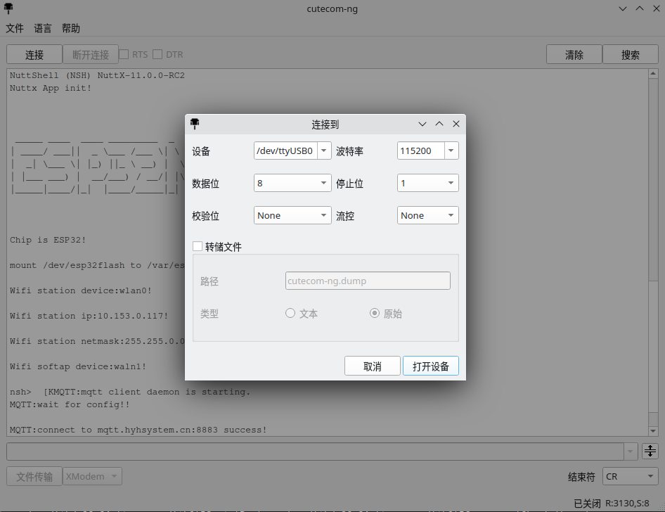

# 说明

本工程为个人修改版。基于[cutecom-ng](ReadMeOld.md),添加一些个人常用的功能

## 截图





## 插件

在使用串口工具时，经常需要对接收的串口数据进行处理，而这部分处理过程可能是多变的（如定时发送序列化的数据，使用串口数据进行绘图等）。

Qt的Qml技术即可满足此需求，数据处理过程可以以简单的方式修改且无需再次编译，也能提供丰富的GUI支持。

模板（插件加载时不关心后缀名）见：[script/qml/](script/qml/)

# 编译

安装好Qt5、SerialPort扩展及QtDeclarative。安装好qtcreator。

对于ubuntu可采用以下命令安装:

```bash
sudo apt-get install qtcreator libqt5serialport5-dev qtdeclarative5-dev
#如需使用Qt6,可使用以下命令替换上面的命令
sudo apt-get install qtcreator libqt6serialport6-dev qt6-declarative-dev
```

## 使用qtcreator编译

直接使用qtcreator打开cutecom-ng.pro。

## 使用make编译

使用以下命令生成makefile:

```bash
qmake -makefile cutecom-ng.pro
```

若命令成功，则可直接使用make编译：

```bash
make
```

编译完成后，可在bin目录中找到编译完成的二进制文件。

# 运行

由于使用了qml模块，因此需要保证下列模块已安装：

- QtQuick
- QtQuick.Controls 
- QtQuick.Dialogs

对于ubuntu可采用以下命令安装Qml模块:

```bash
sudo apt-get install qml-module-qtquick-controls qml-module-qtquick-dialogs
#如需使用Qt6,可使用以下命令替换上面的命令
sudo apt-get install qml6-module-qtquick-controls qml6-module-qtquick-dialogs
```
